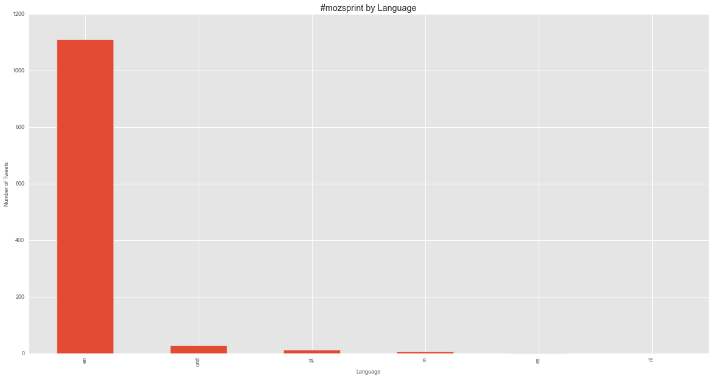
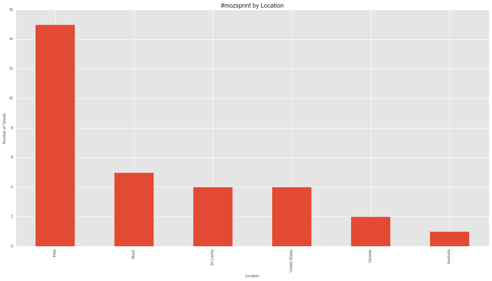
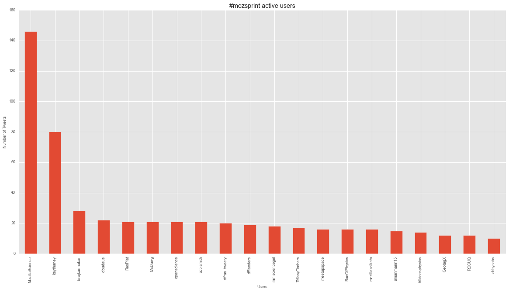
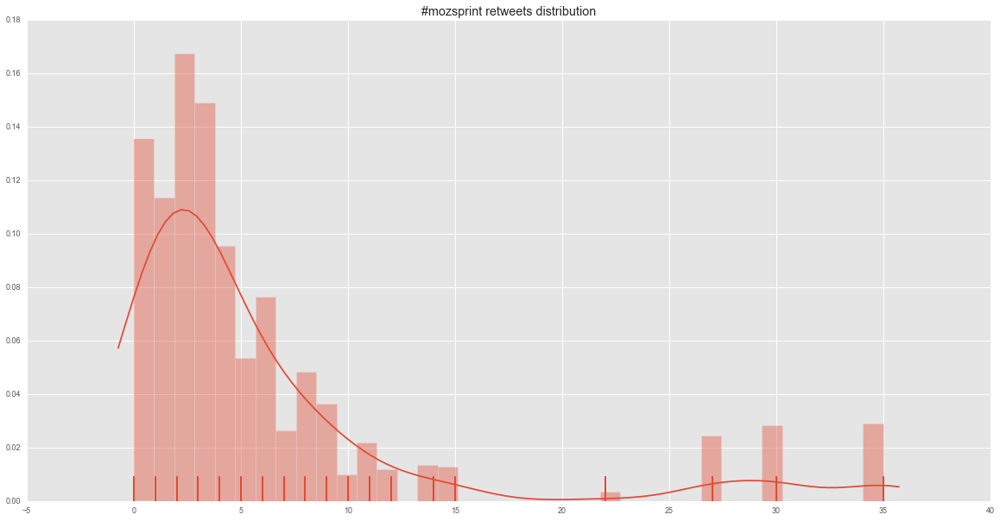
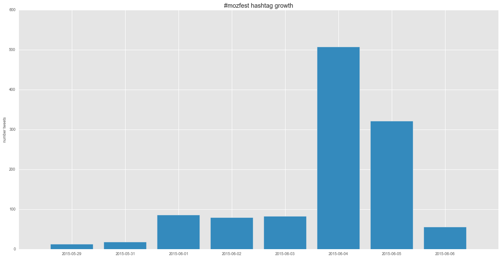
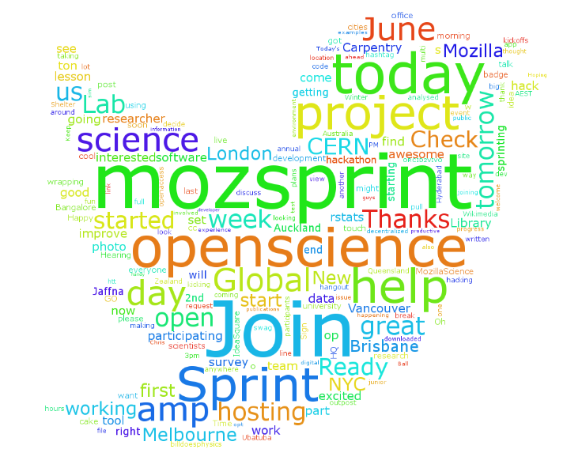

# Using Python for Social Events data analysis

##Purpose

This is a small test before starting working on something more robust for event growth tracking. I wanted to play with the data generated by the `#mozsprint` hackathon organized by Mozilla Science Lab.

In this short notebook I will keep adding notes on tests I am doing to get insights from these 2 days hackathon
Any contribution is more than welcome

Also if you want to join me on trello I created [a board for this](https://trello.com/b/HXqkPO6U/mozsprint-hackathon)  and I will try to write a blog post about tips for getting ready to take a hackathon :) 

In this notebook I will be doing a lot of data transformation and conversion. I will use classic python libraries like pandas and matplotlib, but also I will introduce some others that are needed for specific purposes like creating a word cloud from a text


##Questions we want to answer


When it comes to an event like `#mozsprint`, it is hard to get realtime feedback about its growth unless it is big enough to be discussed and debated in a social network such twitter. The Mozilla Science team did an amazing job to prepare for the `#mozsprint` by making a lot of people involved all over the world, which results in a considerable amount of tweets (data) that one can extract and play with to see the event itself from different angles.

These are the questions that I was personnally intereted in :

- How many tweets containing the hashtag `mozsprint` (general idea on the size of these 2 days event)
- What is the growth of these tweets over time 
- What is the distribution of the retweets containing the hashtag `mozsprint`
- What is the list of influencers tweeps
- Who is more active using the hashtag `mozsprint`
- What are the most tweeted terms related to `mozsprint`
- What is the top 10 most important tweets
- What is the demographics of tweeps involved in `mozsprint`

These are basic ideas that we can improve later, but this already gives an insight on the evolution of the `mozsprint` event

## Libraries used

Libraries used here are classic, like pandas to store extracted information into dataframe, matplotlib and seaborn to plot the data we need, etc..

Because we are interacting with Twitter, we need a python library that is flexible enough to make the information extraction as easy as possible. I chose `tweepy` because it looks enough for what we want to achieve here. We will be asking Twitter to give us stream of information using `#mozsprint` keyword, the returned information will be saved in `json` format in the rest of this session

```language-python

    %matplotlib inline
    from tweepy import OAuthHandler
    from tweepy import API
    from tweepy import Cursor
    import json
    import pandas as pd
    import matplotlib as mpl
    #mpl.use('Agg')
    import matplotlib.pyplot as plt
    from matplotlib.ticker import MaxNLocator
    from matplotlib import rcParams
    from mpltools import style
    from matplotlib import dates
    from datetime import datetime
    import seaborn as sns
    import time
    import os
    from scipy.misc import imread
    from wordcloud import WordCloud, STOPWORDS, ImageColorGenerator
    import random

```

Now let's set some options for the plots we will code, I like the way R plots look like, so we will add a small trick to make matplotlib plots look like `ggplot2` in R. We also define how seaborn plots wiill look like

```language-python

    # Seaborn plots
    sns.set_palette("deep", desat=.6)
    sns.set_context(rc={"figure.figsize": (8, 4)})
    # for R lovers :)
    style.use('ggplot')
    rcParams['axes.labelsize'] = 9
    rcParams['xtick.labelsize'] = 9
    rcParams['ytick.labelsize'] = 9
    rcParams['legend.fontsize'] = 7
    # rcParams['font.family'] = 'serif'
    rcParams['font.serif'] = ['Computer Modern Roman']
    rcParams['text.usetex'] = False
    rcParams['figure.figsize'] = 20, 10

```

## Prepare your app

Because we are using tweepy, and if you go to their official documentation, you will learn that you need to create an app first related to your twitter account on the apps.twitter.com website. Once you create the application that will be used with your code, you will be given a set of tokens and secret code that you need to provide to your code here in order to connect to the twitter API, I will put the ones I used myself at the time of this tutorial writing, just to get an idea on how these tokens look like, but by the time you read this, these will no longer be useful.


```language-python

    access_token = "57309864-yMqpAwr8dkkVa0F2ly3dr49gawHbx5MH5BbmONKEo"
    access_token_secret = "Pk2b5muUbrsAsJSVKUbcmero1MDabO1swjoLQiZB78GCH"
    consumer_key = "EAUofwA8dzhcIBp3fPfuZWHgr"
    consumer_secret = "pbcUtg76fR1mAXga06HaVitZBiPznPM0eUktEbaot8yni53M4v"

```

Ok now let's set the maximum number of tweets to extract, remember ! Twitter usually limit the number of records you can extract at a time, and when they spot your account asking too much information from the API, you can be unable to use the API for at least 15 min (we will manage this later)

```language-python

    MAX_TWEETS = 8000

```

Ok now let's connect to the API using the credentials we defined earlier

```language-python

    # This handles Twitter authentication and the connection to Twitter Streaming API
    auth = OAuthHandler(consumer_key, consumer_secret)
    auth.set_access_token(access_token, access_token_secret)
    api = API(auth, wait_on_rate_limit=True)

```

You will notice the `wait_on_rate_limit=True` this is to tell your program to not return the `402` error code from twitter and to wait the needed time in order to resume the task.

##Data extraction

Now we are connected to the API and we are ready to send our first query to Twitter. We will used the classic search API function to ask for the hashtag `#mozsprint`


```language-python

    data = Cursor(api.search, q='mozsprint').items(MAX_TWEETS)

```

Now we will initialise an empty list called `mozsprint_data` this will contain the returned results as `json` objects, each list element will be basically a `json` format of a tweet with all the information.

If you are wondering what a tweet looks like in `json` this is an approxaimation of its structure, we will be actually looking at something very similar


Now we will :
    - Fill that list of tweets
    - save the json tweet results for future loading without asking the same information from the API

```language-python

    mozsprint_data = []
    # You will use this line in production instead of this
    # current_working_dir = os.path.dirname(os.path.realpath(__file__))
    current_working_dir = "./"
    log_tweets = current_working_dir  + str(time.time()) + '_moztweets.txt'
    with open(log_tweets, 'w') as outfile:
        for tweet in data:
            mozsprint_data.append(json.loads(json.dumps(tweet._json)))
            outfile.write(json.dumps(tweet._json))
            outfile.write("\n")

```

Let's see what we have in our first list element 

```language-python

    print mozsprint_data[0]

    {u'contributors': None, u'truncated': False, u'text': u'RT @justin_littman: Just downloaded the @ORCID_Org public data file (http://t.co/pEtCav7cKf) to find some examples for https://t.co/84Fflcz\u2026', u'is_quote_status': False, u'in_reply_to_status_id': None, u'id': 607297684182036480, u'favorite_count': 0, u'source': u'<a href="http://www.flipboard.com" rel="nofollow">Flipboard</a>', u'retweeted': False, u'coordinates': None, u'entities': {u'symbols': [], u'user_mentions': [{u'indices': [3, 18], u'screen_name': u'justin_littman', u'id': 481186914, u'name': u'Justin Littman', u'id_str': u'481186914'}, {u'indices': [40, 50], u'screen_name': u'ORCID_Org', u'id': 148815591, u'name': u'ORCID Organization', u'id_str': u'148815591'}], u'hashtags': [{u'indices': [139, 140], u'text': u'mozsprint'}], u'urls': [{u'url': u'http://t.co/pEtCav7cKf', u'indices': [69, 91], u'expanded_url': u'http://bit.ly/1Mar5Xj', u'display_url': u'bit.ly/1Mar5Xj'}, {u'url': u'https://t.co/84FflczWaX', u'indices': [119, 140], u'expanded_url': u'https://github.com/gwu-libraries/orcid2vivo', u'display_url': u'github.com/gwu-libraries/\u2026'}]}, u'in_reply_to_screen_name': None, u'id_str': u'607297684182036480', u'retweet_count': 9, u'in_reply_to_user_id': None, u'favorited': False, u'retweeted_status': {u'contributors': None, u'truncated': False, u'text': u'Just downloaded the @ORCID_Org public data file (http://t.co/pEtCav7cKf) to find some examples for https://t.co/84FflczWaX for #mozsprint.', u'is_quote_status': False, u'in_reply_to_status_id': None, u'id': 606786791237107712, u'favorite_count': 13, u'source': u'<a href="http://twitter.com" rel="nofollow">Twitter Web Client</a>', u'retweeted': False, u'coordinates': None, u'entities': {u'symbols': [], u'user_mentions': [{u'indices': [20, 30], u'screen_name': u'ORCID_Org', u'id': 148815591, u'name': u'ORCID Organization', u'id_str': u'148815591'}], u'hashtags': [{u'indices': [127, 137], u'text': u'mozsprint'}], u'urls': [{u'url': u'http://t.co/pEtCav7cKf', u'indices': [49, 71], u'expanded_url': u'http://bit.ly/1Mar5Xj', u'display_url': u'bit.ly/1Mar5Xj'}, {u'url': u'https://t.co/84FflczWaX', u'indices': [99, 122], u'expanded_url': u'https://github.com/gwu-libraries/orcid2vivo', u'display_url': u'github.com/gwu-libraries/\u2026'}]}, u'in_reply_to_screen_name': None, u'id_str': u'606786791237107712', u'retweet_count': 9, u'in_reply_to_user_id': None, u'favorited': False, u'user': {u'follow_request_sent': False, u'profile_use_background_image': True, u'id': 481186914, u'verified': False, u'profile_text_color': u'333333', u'profile_image_url_https': u'https://pbs.twimg.com/profile_images/496478011533713408/GjecBUNj_normal.jpeg', u'profile_sidebar_fill_color': u'DDEEF6', u'is_translator': False, u'geo_enabled': True, u'entities': {u'description': {u'urls': []}}, u'followers_count': 35, u'protected': False, u'location': u'', u'default_profile_image': False, u'id_str': u'481186914', u'lang': u'en', u'utc_offset': -14400, u'statuses_count': 38, u'description': u'', u'friends_count': 40, u'profile_link_color': u'0084B4', u'profile_image_url': u'http://pbs.twimg.com/profile_images/496478011533713408/GjecBUNj_normal.jpeg', u'notifications': False, u'profile_background_image_url_https': u'https://abs.twimg.com/images/themes/theme1/bg.png', u'profile_background_color': u'C0DEED', u'profile_background_image_url': u'http://abs.twimg.com/images/themes/theme1/bg.png', u'name': u'Justin Littman', u'is_translation_enabled': False, u'profile_background_tile': False, u'favourites_count': 21, u'screen_name': u'justin_littman', u'url': None, u'created_at': u'Thu Feb 02 12:19:18 +0000 2012', u'contributors_enabled': False, u'time_zone': u'Eastern Time (US & Canada)', u'profile_sidebar_border_color': u'C0DEED', u'default_profile': True, u'following': False, u'listed_count': 1}, u'geo': None, u'in_reply_to_user_id_str': None, u'possibly_sensitive': False, u'lang': u'en', u'created_at': u'Fri Jun 05 11:36:59 +0000 2015', u'in_reply_to_status_id_str': None, u'place': None, u'metadata': {u'iso_language_code': u'en', u'result_type': u'recent'}}, u'user': {u'follow_request_sent': False, u'profile_use_background_image': True, u'id': 64645233, u'verified': False, u'profile_text_color': u'333333', u'profile_image_url_https': u'https://pbs.twimg.com/profile_images/1717565784/image_normal.jpg', u'profile_sidebar_fill_color': u'DDFFCC', u'is_translator': False, u'geo_enabled': True, u'entities': {u'description': {u'urls': []}}, u'followers_count': 63, u'protected': False, u'location': u'Helsinki', u'default_profile_image': False, u'id_str': u'64645233', u'lang': u'en', u'utc_offset': 10800, u'statuses_count': 212, u'description': u'', u'friends_count': 198, u'profile_link_color': u'0084B4', u'profile_image_url': u'http://pbs.twimg.com/profile_images/1717565784/image_normal.jpg', u'notifications': False, u'profile_background_image_url_https': u'https://abs.twimg.com/images/themes/theme16/bg.gif', u'profile_background_color': u'9AE4E8', u'profile_background_image_url': u'http://abs.twimg.com/images/themes/theme16/bg.gif', u'name': u'Annikki Roos', u'is_translation_enabled': False, u'profile_background_tile': False, u'favourites_count': 39, u'screen_name': u'AnnikkiRoos', u'url': None, u'created_at': u'Tue Aug 11 06:27:12 +0000 2009', u'contributors_enabled': False, u'time_zone': u'Helsinki', u'profile_sidebar_border_color': u'BDDCAD', u'default_profile': False, u'following': False, u'listed_count': 7}, u'geo': None, u'in_reply_to_user_id_str': None, u'possibly_sensitive': False, u'lang': u'en', u'created_at': u'Sat Jun 06 21:27:05 +0000 2015', u'in_reply_to_status_id_str': None, u'place': None, u'metadata': {u'iso_language_code': u'en', u'result_type': u'recent'}}

```

FANTASTIC ! That worked like a charm, but let's make things look nicer, because right now it is ugly
We will create a pandas dataframe and we will extract the information we want instead of everything

## Exploring #mozsprint tweets


```language-python


    # Create the dataframe we will use
    tweets = pd.DataFrame()
    # We want to know when a tweet was sent
    tweets['created_at'] = map(lambda tweet: time.strftime('%Y-%m-%d %H:%M:%S', time.strptime(tweet['created_at'],'%a %b %d %H:%M:%S +0000 %Y')), mozsprint_data)
    # Who is the tweet owner
    tweets['user'] = map(lambda tweet: tweet['user']['screen_name'], mozsprint_data)
    # How many follower this user has
    tweets['user_followers_count'] = map(lambda tweet: tweet['user']['followers_count'], mozsprint_data)
    # What is the tweet's content
    tweets['text'] = map(lambda tweet: tweet['text'].encode('utf-8'), mozsprint_data)
    # If available what is the language the tweet is written in
    tweets['lang'] = map(lambda tweet: tweet['lang'], mozsprint_data)
    # If available, where was the tweet sent from ?
    tweets['Location'] = map(lambda tweet: tweet['place']['country'] if tweet['place'] != None else None, mozsprint_data)
    # How many times this tweet was retweeted and favorited
    tweets['retweet_count'] = map(lambda tweet: tweet['retweet_count'], mozsprint_data)
    tweets['favorite_count'] = map(lambda tweet: tweet['favorite_count'], mozsprint_data)

```


Let's see how things look like now :

```language-python

    print tweets.head()

                created_at            user  user_followers_count  \
    0  2015-06-06 21:27:05     AnnikkiRoos                    63   
    1  2015-06-06 19:55:32          gawbul                  2984   
    2  2015-06-06 19:51:29          gawbul                  2984   
    3  2015-06-06 16:51:14        PaleoCar                    24   
    4  2015-06-06 14:51:21  BrazilRetweets                   141   
    
                                                    text lang Location  \
    0  RT @justin_littman: Just downloaded the @ORCID...   en     None   
    1  RT @gregcaporaso: making our first contrib to ...   en     None   
    2  RT @adcadien: Super impressed with everyone at...   en     None   
    3  RT @abbycabs: How can we encourage researchers...   en     None   
    4  RT @junior2014CCS: Yesterday photo going to #m...   en     None   
    
       retweet_count  favorite_count  
    0              9               0  
    1              8               0  
    2              5               0  
    3              8               0  
    4              1               0  

```

Awesome, it looks like a table we can use now. You will notice that some tweets start with `RT` which is a retweet, so this may create a bias if we want to now the number of original tweets and the number of retweets.


```language-python

    list_of_original_tweets = [element for element in tweets['text'].values if not element.startswith('RT')]


    print list_of_original_tweets[0]

    Bio experiments #tropixel #mozsprint http://t.co/wuNx86uYMN


    print "Number of Original Tweets : " + str(len(list_of_original_tweets))

    Number of Original Tweets : 372


    list_of_retweets = [element for element in tweets['text'].values if element.startswith('RT')]


    print "Number of Retweets : " + str(len(list_of_retweets))

    Number of Retweets : 791

```

## Tweets visualization

Ok now let's create some function to see some data. We will create that generic function that I will discuss in a few mooment, let's look at it first


```language-python

    # General plotting function for the different information extracted
    def plot_tweets_per_category(category, title, x_title, y_title, top_n=5, output_filename="plot.png"):
        """
        :param category: Category plotted, can be tweets users, tweets language, tweets country etc ..
        :param title: Title of the plot
        :param x_title: List of the items in x
        :param y_title: Title of the variable plotted
        :return: a plot that we can save as pdf or png instead of displaying to the screen
        """
        tweets_by_cat = category.value_counts()
        fig, ax = plt.subplots()
        ax.tick_params(axis='x')
        ax.tick_params(axis='y')
        ax.set_xlabel(x_title)
        ax.set_ylabel(y_title)
        ax.set_title(title)
        tweets_by_cat[:top_n].plot(ax=ax, kind='bar')
        fig.savefig(output_filename)
        fig.show()

```

This function will be used with different parameters of the `tweets` dataframe we created earlier, it will basically create a bar plot for a specific column of this dataframe. Let's see an example :

```language-python

    plot_tweets_per_category(tweets['lang'], "#mozsprint by Language", 
                             "Language", 
                             "Number of Tweets", 
                             2000,
                             "mozsprint_per_language.png")


```




Great ! It looks like english is the most used tweet language for the `mozsprint`, that said you can appreciate some tweets in portuguese for example ! That's cool

Ok now let's see from where these tweets are coming from 

```language-python

    plot_tweets_per_category(tweets['Location'], 
                             "#mozsprint by Location", 
                             "Location", 
                             "Number of Tweets", 2000,
                             "mozsprint_per_location.png")


```




Ok ! This is may be a bit biased. What this is telling us is that first of all, not all tweeps specify locations in their profile data on Twitter, among the few of thos who are doing this and that are actually involved in the mozsprint, most of these people are in India. I guess Twitter is giving this option to users to prevent their privacy, but it makes all the geo queries a bit biased, .. somehow

Now, who is the most engaged on twitter for the mozsprint ?

```language-python

    plot_tweets_per_category(tweets['user'], 
                             "#mozsprint active users", 
                             "Users", 
                             "Number of Tweets", 20,
                             "mozsprint_users.png")


```




Of course ! @MozillaScience was very active followed by @kaythaney (Kaitlin Thaney is the director of MSL :) ), well it seems like it make sense, this is great. Note here that we are not counting usernames in the tweet texts, we are playing with the users column in our tweet dataframe.

Ok now let's see the distribution of retweets, for this we will create a similar generic function but we will be using seaborn instead :


```language-python

    def plot_distribution(category, title, x_title, y_title, output_filename="plot.png"):
        """
        :param category: Category plotted, can be users, language, country etc ..
        :param title: Title of the plot
        :param x_title: List of the items in x
        :param y_title: Title of the variable plotted
        :return: a plot that we can save as pdf or png instead of displaying to the screen
        """
        fig, ax = plt.subplots()
        ax.tick_params(axis='x')
        ax.tick_params(axis='y')
        ax.set_xlabel(x_title)
        ax.set_ylabel(y_title)
        ax.set_title(title)
        sns.distplot(category.values, rug=True, hist=True);
        fig.savefig(output_filename)


    plot_distribution(tweets['retweet_count'], 
                      "#mozsprint retweets distribution", "", "",
                      "retweets_distribution.png")

```




distplot provides one interface for plotting histograms, kernel density plots, rug plots, and plotting fitted probability distributions. distplot tries to use a good number of bins for the dataset you have, although all of the options for specifying bins in hist can be used.

##Plotting engagement (data transformation)

One more thing we can examine is the trend of the tweets, in other words when people started tweeting about #mozsprint and when the peak was reached, for this we will focus on the tweet submission date column

But for that we need to transform the dates, ang group by days, and then summing the number of variables we want to plot, this is a good example of data transformation

```language-python

    df = pd.DataFrame(tweets['created_at'].value_counts(), columns=['number_tweets'])
    df['date'] = df.index
    df.head()

```


<div style="max-height:1000px;max-width:1500px;overflow:auto;">
<table border="1" class="dataframe">
  <thead>
    <tr style="text-align: right;">
      <th></th>
      <th>number_tweets</th>
      <th>date</th>
    </tr>
  </thead>
  <tbody>
    <tr>
      <th>2015-06-04 09:08:28</th>
      <td>3</td>
      <td>2015-06-04 09:08:28</td>
    </tr>
    <tr>
      <th>2015-06-04 00:21:19</th>
      <td>3</td>
      <td>2015-06-04 00:21:19</td>
    </tr>
    <tr>
      <th>2015-06-04 09:03:51</th>
      <td>3</td>
      <td>2015-06-04 09:03:51</td>
    </tr>
    <tr>
      <th>2015-06-04 09:06:57</th>
      <td>3</td>
      <td>2015-06-04 09:06:57</td>
    </tr>
    <tr>
      <th>2015-06-04 08:45:05</th>
      <td>3</td>
      <td>2015-06-04 08:45:05</td>
    </tr>
  </tbody>
</table>
</div>


```language-python


    days = [item.split(" ")[0] for item in df['date'].values]
    df['days'] = days
    grouped_tweets = df[['days', 'number_tweets']].groupby('days')
    tweet_growth = grouped_tweets.sum()
    tweet_growth['days']= tweet_growth.index
    
    tweet_growth

```


<div style="max-height:1000px;max-width:1500px;overflow:auto;">
<table border="1" class="dataframe">
  <thead>
    <tr style="text-align: right;">
      <th></th>
      <th>number_tweets</th>
      <th>days</th>
    </tr>
    <tr>
      <th>days</th>
      <th></th>
      <th></th>
    </tr>
  </thead>
  <tbody>
    <tr>
      <th>2015-05-29</th>
      <td>13</td>
      <td>2015-05-29</td>
    </tr>
    <tr>
      <th>2015-05-31</th>
      <td>18</td>
      <td>2015-05-31</td>
    </tr>
    <tr>
      <th>2015-06-01</th>
      <td>86</td>
      <td>2015-06-01</td>
    </tr>
    <tr>
      <th>2015-06-02</th>
      <td>79</td>
      <td>2015-06-02</td>
    </tr>
    <tr>
      <th>2015-06-03</th>
      <td>83</td>
      <td>2015-06-03</td>
    </tr>
    <tr>
      <th>2015-06-04</th>
      <td>507</td>
      <td>2015-06-04</td>
    </tr>
    <tr>
      <th>2015-06-05</th>
      <td>321</td>
      <td>2015-06-05</td>
    </tr>
    <tr>
      <th>2015-06-06</th>
      <td>56</td>
      <td>2015-06-06</td>
    </tr>
  </tbody>
</table>
</div>


```language-python

    import numpy as np
    fig = plt.figure()
    ax = plt.subplot(111)
    x_pos = np.arange(len(tweet_growth['days'].values))
    ax.bar(x_pos, tweet_growth['number_tweets'].values, align='center')
    ax.set_xticks(x_pos)
    ax.set_title('#mozfest hashtag growth')
    ax.set_ylabel("number tweets")
    ax.set_xticklabels(tweet_growth['days'].values)
    fig.savefig('mozfest_growth.png')

```




In fact, first day of the hackathon was the peak, but we can observe a plateau before the `mozsprint` starts, that means two things, the event was successfully planned and announced, and the peak is a translation of how much viral it went. Very good job Mozilla Science Team !

## Final touch : The Word Cloud

Like any event, we are always curious about that number of words that gravitates around a topic, when `mozsprint` started, you can observe a whole bunch of tweets and other hashtags as well as recurrent terms. In order to see if there is a correlation between these words and the current topic, we can follow several approoaches, one of these is to extract all tweets text and proceed with a textmining technique to classify words by category or by context. But as a closing note to this notebook I wanted to do something lighter, word cloud. Simple, clear and speaks for itself. So let's create one.

We are lucky because there is a library just for that.

```language-python

    text = " ".join(tweets['text'].values.astype(str))

```

This will concatenate all tweets in a single string ! (you don't wana read that :) )


```language-python

    no_urls_no_tags = " ".join([word for word in text.split()
                                if 'http' not in word
                                    and not word.startswith('@')
                                    and word != 'RT'
                                ])

```

We will remove all retweets prefixes like RT or username mention or http etc ..

```language-python

    moz_mask = imread("./twitter_mask.png", flatten=True)


    wc = WordCloud(background_color="white", font_path="/Library/Fonts/Verdana.ttf", stopwords=STOPWORDS, width=1800,
                          height=140, mask=moz_mask)
    wc.generate(no_urls_no_tags)
    plt.imshow(wc)
    plt.axis("off")
    plt.savefig('mozsprint.png', dpi=300)

   
```



